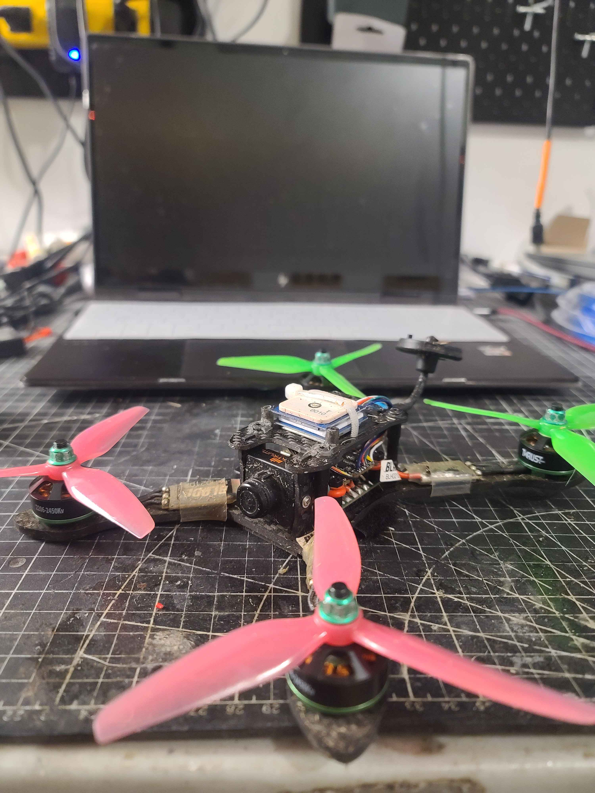
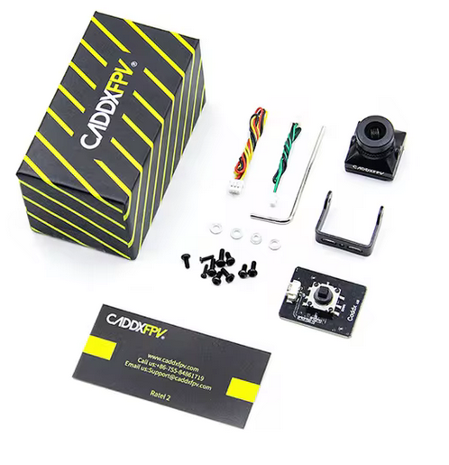
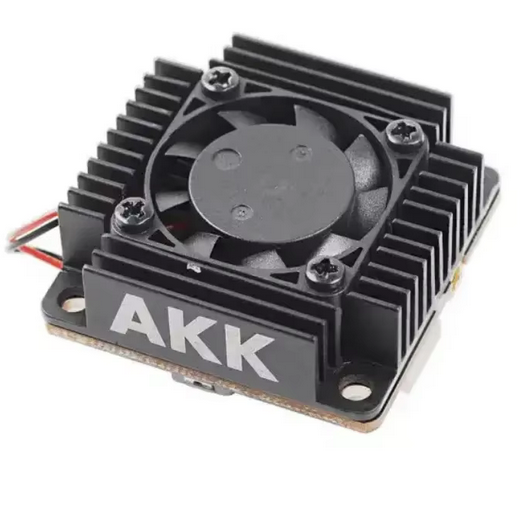

# BladeTheoryXL
Build log of my custom FPV drone built off an old Blade Theory XL

https://www.bladehelis.com/product/theory-xl-5-fpv-bnf-basic/BLH02150.html
Archive of the above link can be found in this repo. 
## Personal Tune

## Parts

### Frame
Stock 4mm carbon fiber Blade Theory XL frame.

### Flight Controller
Originally a Spektrum F3 controller but was replaced with F4V3S clone from aliexpress
https://www.aliexpress.com/item/1005005407722952.html

### Camera
Originally had a 700 TVL Spektrum camera. Wow this was such a bad camera. Terrible FOV and no OSD support.
Replacing with a CADDX Ratel 2. Currently waiting for it to arrive.

### Video Transmitter (VTX) 
200mw VTX is actually quite nice. Range is very good for 200mw. Unfortunately you have to physically turn on the VTX button every flight. 
I am replacing this with AKK Long range 3W VTX. Currently waiting for it to arrive.
https://www.aliexpress.com/item/1005006955054449.html

### Reciever
Originally had a Spektrum SPM4649T / SH703X reciever that refused to go into bind mode.
Replaced with SpeedyBee ELRS Nano reciever from amazon
https://www.amazon.ca/dp/B0CTBWQ91P

### ESC
Stock power delivery board, and 30A BLHeli ESCS running OneShot125 protocol. ESCs are kinda bad, but after a custom tune they were alright. They didn't seem to have the precision of more modern ESCS using DSHOT protocol. I have the parts to replace these, but I'd like to ride these until they die so that I dont' make ewaste.

### Motors

