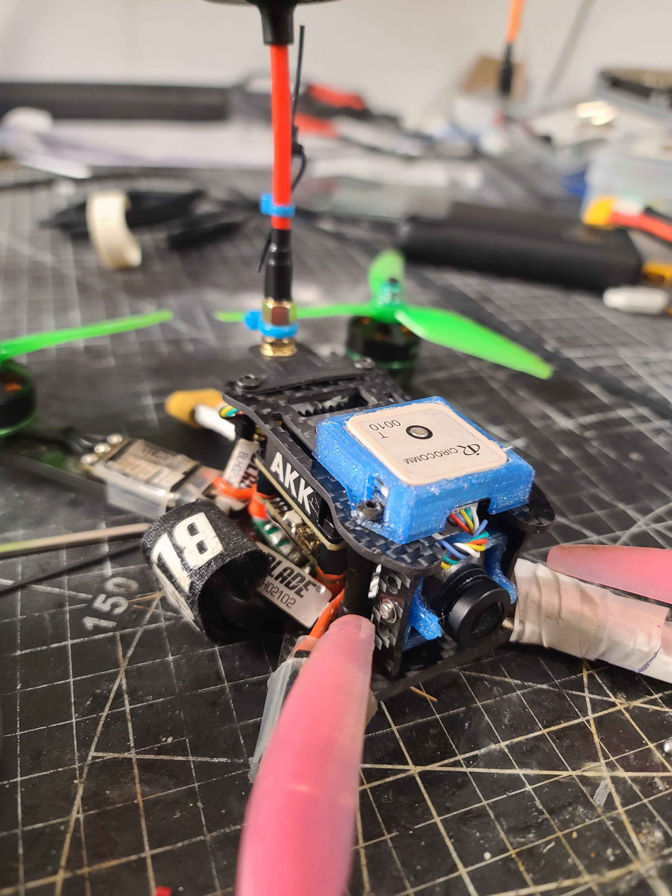
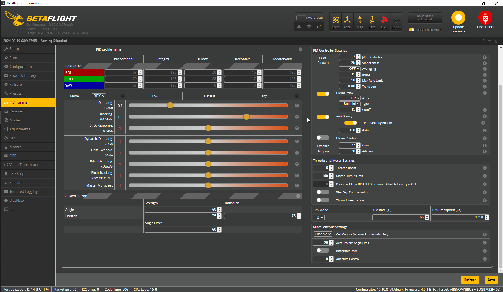
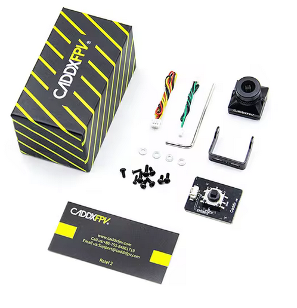
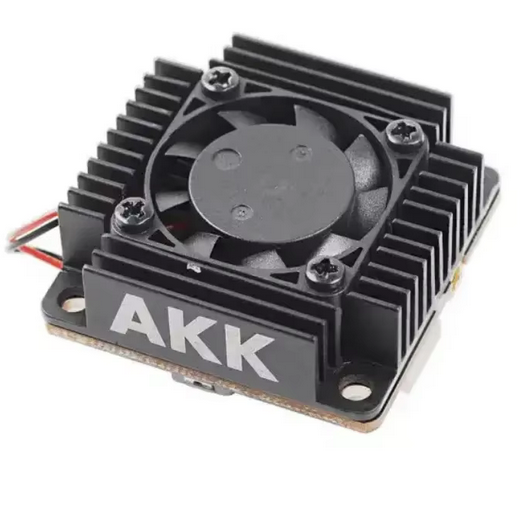
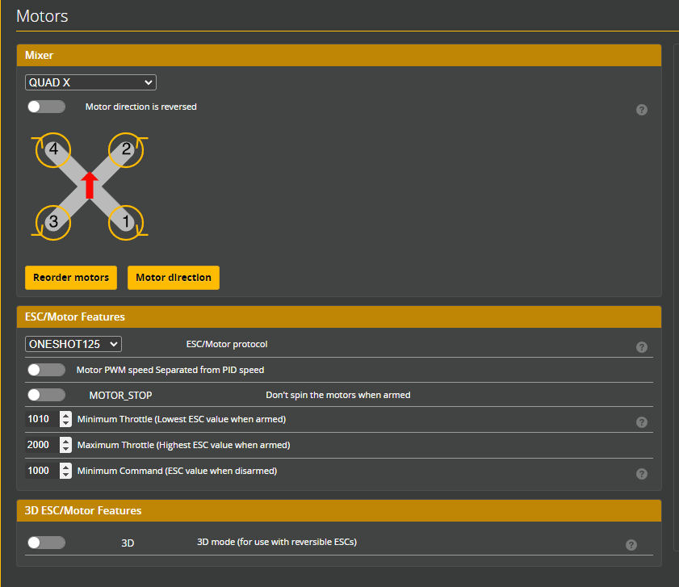
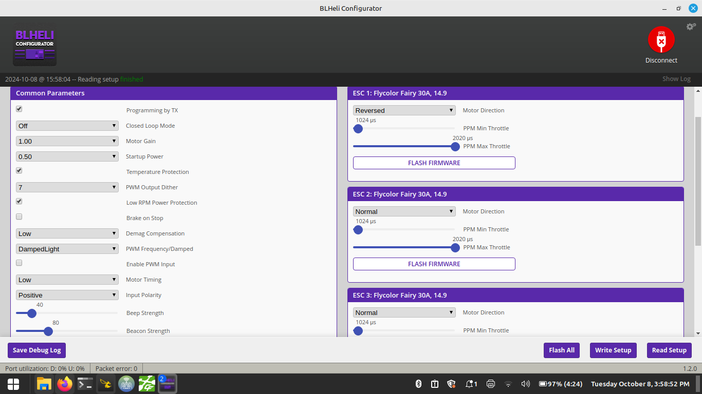

# BladeTheoryXL

Build log of my custom FPV drone built off an old Blade Theory XL





https://www.bladehelis.com/product/theory-xl-5-fpv-bnf-basic/BLH02150.html

Archive of the above link can be found in this repo.

## Quick Overview

Frame: Blade Theory XL

Motors:Blade BLHA1023 Thrust Series 2206-2450Kv

ESC: 4 x Blade BLH02102 (FlyColor Fairy 30A)

Flight Controller: OMNIBUSF4SD w/ ICM42688P Gyro

VTX: AKK Ultra Long Range 3 Watt

Camera: Caddx Ratel 2

RX: SpeedyBee ELRS Nano

GPS: Beitan BN-880

Propellers: Ethix S3 Watermelon

Battery: 4S 1600mAh Lipo(10m Flight time) or 3S 4200mAh Molicel P42A pack (?m Flight time)

## Personal Tune and Config




## Parts

### Frame
Stock 4mm carbon fiber Blade Theory XL frame.

### Flight Controller
Originally a Spektrum F3 controller but was replaced with F4V3S clone from aliexpress

https://www.aliexpress.com/item/1005005407722952.html


### Camera
Originally had a 700 TVL Spektrum camera. Wow this was such a bad camera. Terrible FOV and no OSD support.
Replacing with a CADDX Ratel 2. Currently waiting for it to arrive.




### Video Transmitter (VTX) 
Stock 200mw Spektrum VTX is actually quite nice. Range is very good for 200mw. Unfortunately you have to physically turn on the VTX button every flight. 

I am replacing this with AKK Long range 3W VTX. Currently waiting for it to arrive.

https://www.aliexpress.com/item/1005006955054449.html




The AKK VTX seems really good. I put silicone conformal coating on it, and used SoftSerial to turn Motor5 pad into TX for the SmartAudio connection. I setup the VTX table, but had to manually set 5 bands in the table first. I then transferred the VTX switch settings from my Eachine Cvatar to be able to change VTX power using the 6 button switch at the top of my Jumper Tpro radio. 

Ultra Long Range VTX Table:
```
vtxtable channels 8
vtxtable band 1 BOSCAM_A A FACTORY 5865 5845 5825 5805 5785 5765 5745 5725
vtxtable band 2 BOSCAM_B B FACTORY 5733 5752 5771 5790 5809 5828 5847 5866
vtxtable band 3 BOSCAM_E E FACTORY 5705 5685 5665 0 5885 5905 0 0
vtxtable band 4 FATSHARK F FACTORY 5740 5760 5780 5800 5820 5840 5860 5880
vtxtable band 5 RACEBAND R FACTORY 5658 5695 5732 5769 5806 5843 5880 5917
vtxtable powerlevels 5
vtxtable powervalues 0 1 2 3 4
vtxtable powerlabels 250 500 1000 2000 3000
```

VTX Switch Based on Aux Channel 4:
```
vtx 0 3 0 0 1 1175 1375
vtx 1 3 0 0 2 1375 1525
vtx 2 3 0 0 3 1525 1650
vtx 3 3 0 0 5 1650 1850
```

This configuration changes VTX power based on the position of AUX channel 4. This skips the 2 watt setting on the VTX as I don't want to waste buttons to map out every power level. These buttons can then be reserved for future functionality.

### Reciever
Originally had a Spektrum SPM4649T / SH703X reciever that refused to go into bind mode.

Replaced with SpeedyBee ELRS Nano reciever from amazon

https://www.amazon.ca/dp/B0CTBWQ91P

### ESC
Stock power delivery board, and 30A BLHeli ESCS (BLH02102) running OneShot125 protocol.

ESCs are kinda bad, but after a custom tune they were alright. They didn't seem to have the precision of more modern ESCS using DSHOT protocol. 

I have the parts to replace these, but I'd like to ride these until they die so that I don't make ewaste.





### Motors
Stock 2206 size motors at 2450Kv

### GPS
Beitan BN-880 GPS unit for return to home failsafe functionality

Compass Setup:
```
resource SERIAL_TX 3 NONE
resource SERIAL_RX 3 NONE
resource I2C_SCL 2 B10
resource I2C_SDA 2 B11
set mag_bustype = I2C
set mag_i2c_device = 2
set mag_i2c_address = 0
set mag_spi_device = 0
set mag_hardware = AUTO
save
```

### VTX Mount 3D Print


https://www.thingiverse.com/thing:6790557

### GPS Mount 3D Print


https://www.thingiverse.com/thing:6790582
